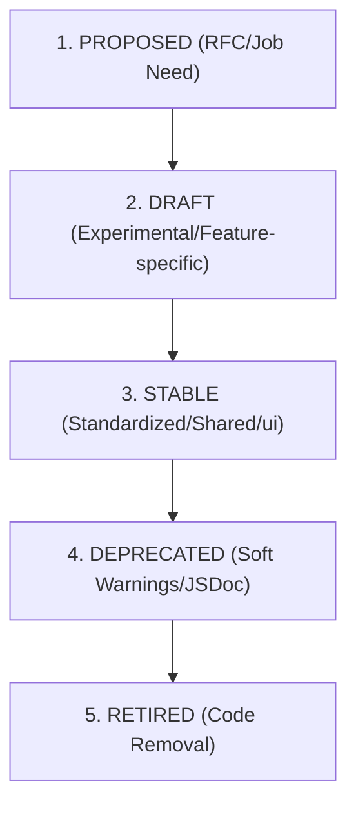

# 🎨 JobLyne Design System Governance & Quality Assurance Guide

This document establishes the official governance, lifecycle, versioning, responsive testing, and accessibility assurance standards for the JobLyne component library, aligning with the core product design principles.

---

## 1. Design System Governance & Component Lifecycle

To maintain consistency and minimize code debt, every UI component must follow this lifecycle.



### Component States Checklist
Before any component transitions from **Draft** to **Stable**, it must implement and document all applicable states from the state matrix:
`Default · Hover · Focus · Active/Pressed · Loading · Disabled · Error · Success · Empty · Read-only · Offline · Selected`

### Versioning Policies (Semantic Versioning)
We follow standard Semantic Versioning (`MAJOR.MINOR.PATCH`):
- **PATCH** (`0.0.+1`): Bug fixes, CSS styling fixes, accessibility improvements, refactoring internal component logic without prop changes.
- **MINOR** (`0.+1.0`): Adding new components, introducing new optional props, or deprecating existing props/options.
- **MAJOR** (`+1.0.0`): Modifying or removing required props, changing expected keyboard interaction patterns, or retiring deprecated code blocks.

### Deprecation Policy & Migration
1. **Annotation:** Annotate the deprecated component/props using JSDoc tags:
   ```ts
   /**
    * @deprecated Use the new custom Toggle component instead.
    * Will be retired in v2.0.0.
    */
   ```
2. **Development warning:** Print clear warnings in development logs if the component is used:
   ```ts
   if (process.env.NODE_ENV !== "production") {
     console.warn("[DesignSystem] <LegacyComponent> is deprecated and will be removed in next major release.");
   }
   ```
3. **Migration Guide:** Standardize migrations via a markdown file in the pull request documenting a clear copy-paste equivalent block.

---

## 2. Responsive QA Matrix

All components and feature pages must be manually tested and verified across these responsive breakpoints before production merge.

| Breakpoint | Target Devices | Visual Rules | Verification Checklist |
|---|---|---|---|
| **360px** | Compact Mobile | Single column layout, elements stack vertically, container gutters at `16px`. | - [ ] Touch targets are $\ge$ 44px (pad hitboxes if visible nodes are smaller)<br>- [ ] Drawers or bottom-sheets replace large modals<br>- [ ] Tables stack into cards or enable sticky-column horizontal scroll |
| **768px** | Tablets / Foldables | Sidebars collapse into hamburgers/drawers, grid columns adapt to 2-columns. | - [ ] Nav menu handles transition without layout shift or wrap overflows<br>- [ ] Form groups group into columns where visual balance allows |
| **1024px** | Laptops / Small Displays | Full sidebar displays, layouts span 3 columns, hover microinteractions enabled. | - [ ] Focus rings are visible on keyboard navigation (`:focus-visible` check)<br>- [ ] Left/right split columns align horizontally |
| **1440px+** | Desktop Displays | Standard container capped at `1280px` or `1440px` max-width with fluid layouts. | - [ ] Page elements do not stretch excessively<br>- [ ] Text content columns capped at `640px` - `720px` to maintain readability |

---

## 3. Screen Reader & Accessibility Verification Pass

To ensure compliance with **WCAG 2.2 AA** (Section 16), follow these keyboard and screen reader verification checklists.

### 1. General Keyboard & Semantics
- [ ] **Roving tabIndex:** Only the active element of a component (e.g., active tab in Tabs, selected item in RadioGroup) is in the natural tab order (`tabIndex={0}`). All other siblings have `tabIndex={-1}`.
- [ ] **Visible Focus Rings:** Every interactive element has an explicit outline (e.g. `focus-visible:ring-2 focus-visible:ring-primary focus-visible:ring-offset-2`).
- [ ] **Semantics Over ARIA:** Prefer native HTML tags (`<fieldset>`, `<legend>`, `<dialog>`, `<select>`, `<button>`) over raw ARIA mockups where possible.

### 2. Component Audits (Screen Reader Scripts)

#### Select
- **Expected screen reader output:** Announces label, helper text, and error text via `aria-describedby` when focus lands on the select box.
- **Verification:**
  1. Tab focus lands on the select input.
  2. Verify screen reader reads: *"Country, Select list, Choose your country (helper text)"*.
  3. Change value to trigger error, refocus. Verify it reads: *"Country, invalid input, Country is required (error text)"*.

#### Tabs
- **Expected screen reader output:** Announces *"Tab [Name], Tab 2 of 5, Selected"* or similar when active.
- **Keyboard verification:**
  1. Focus active tab → press `ArrowRight` or `ArrowLeft`. Focus moves to the next/prev tab but active view does not change.
  2. Verify screen reader reads tab names as you focus them.
  3. Press `Enter` or `Space` on a focused tab. View changes and screen reader announces *"Selected"*.
  4. Focus first item, press `Home` → focus goes to first enabled tab. Press `End` → focus goes to last enabled tab.

#### Dialog
- **Expected screen reader output:** Focus shifts automatically to the first interactive element inside the modal on open, announcing the dialog's title and role: *"Dialog, [Title Name]"*.
- **Keyboard verification:**
  1. Open Dialog. Focus immediately moves inside.
  2. Tab repeatedly. Focus wraps from the last focusable element in the dialog back to the first. Focus NEVER escapes into the background document.
  3. Press `Esc` key. Dialog closes.
  4. Verify focus returns to the original button/trigger that opened the dialog.

#### Checkbox
- **Expected screen reader output:** Announces state as *"Checked"*, *"Unchecked"*, or *"Mixed/Indeterminate"*.
- **Verification:**
  1. Tab to checkbox.
  2. Toggle using `Space` key.
  3. When in bulk selection state (partially checked child trees), verify screen reader announces state as *"Mixed"* or *"Indeterminate"*.

#### Tooltip
- **Expected screen reader output:** Tooltip helper text is announced when its target element receives focus.
- **Verification:**
  1. Tab to the triggering child element (e.g., info button).
  2. Tooltip appears via opacity transition.
  3. Verify screen reader voices the tooltip content through the parent's `aria-describedby` connection.

#### Toggle (Switch)
- **Expected screen reader output:** Announces element role as *"Switch"*, with states *"On"* / *"Off"*, rather than checkbox checked/unchecked.
- **Verification:**
  1. Tab to toggle switch. Verify screen reader reads: *"Email notifications, Switch, Off"*.
  2. Press `Space` or `Enter` to toggle. Verify it announces: *"Switch, On"*.

#### RadioGroup
- **Expected screen reader output:** Announces group legend name and current check state (e.g. *"Plan tier, Premium, radio button, 2 of 3, checked"*).
- **Keyboard verification:**
  1. Tab focus lands on the selected radio.
  2. Pressing `ArrowRight` or `ArrowDown` focuses and checks the next option, skipping any disabled options.
  3. Arrowing past the end wraps selection to the first enabled radio option.
  4. Pressing `Tab` exits the group.
