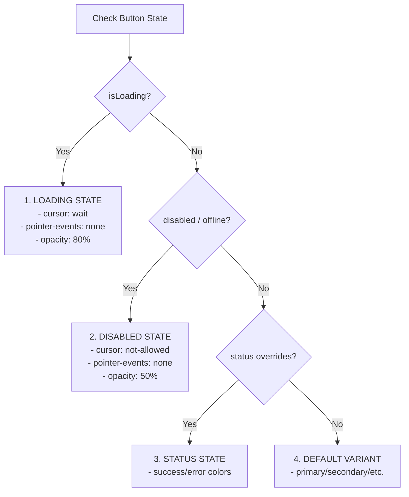

# 🖲️ Button Component

The `Button` component triggers actions or events, such as submitting forms, toggling dialogs, or navigating. It is built strictly on design tokens to maintain visual consistency and dark-mode compliance automatically.

---

## 📖 Purpose
Buttons allow users to take actions with a single click or tap. They serve as primary cues for task completion, navigation, and state transitions.

---

## 🎨 Token Hierarchy & Namespace

The component resolves all styles using component tokens scoped to the `--button-*` namespace, mapping back to semantic and primitive tokens:

| Component Token | Maps To (Semantic) | Maps To (Primitive) | Description |
|---|---|---|---|
| `--button-primary-bg` | `--color-primary` | `#006fff` | Primary fill color |
| `--button-primary-bg-hover`| `--color-primary-dark`| `#0056c6` | Hover state background |
| `--button-primary-text` | `--color-on-primary` | `#ffffff` | Text on primary fill |
| `--button-secondary-bg` | `--color-surface-2` | `#f1f5f9` | Secondary button background |
| `--button-disabled-bg` | `--color-surface-disabled`| `#f1f5f9` / `#2d2d2d` (dark)| Disabled background state |
| `--button-disabled-text` | `--color-text-disabled`| `#94a3b8` / `#64748b` (dark)| Disabled text color |

---

## 📐 Specifications & Sizes

Every size specifies its own height, horizontal padding, typography, and minimum width properties:

- **Compact (`sm`)**:
  - Height: `32px` (`h-8`)
  - Padding: `16px` horizontal (`px-4`)
  - Font Size: `14px` (`text-sm`)
  - Min Width: `80px`
- **Default (`md`)**:
  - Height: `40px` (`h-10`)
  - Padding: `16px` horizontal (`px-4`)
  - Font Size: `14px` (`text-sm`)
  - Min Width: `80px`
- **Large (`lg`)**:
  - Height: `48px` (`h-12`)
  - Padding: `16px` horizontal (`px-4`)
  - Font Size: `16px` (`text-base`)
  - Min Width: `80px`

*Note: The `link` variant and icon-only buttons are excluded from the default `min-width` restriction.*

---

## 🚦 State Machine Precedence

States are evaluated sequentially to ensure a deterministic UI:



---

## 📊 Component State Matrix

| State | Visual Indicator(s) | ARIA & Accessibility | Trigger Condition |
|---|---|---|---|
| **Default** | Primary/secondary colors, text/icons visible | None (Standard interactive state) | Normal state |
| **Hover** | Background transition (`duration-200` color shift) | None | Pointer device hovering |
| **Pressed** | Scale compression (`active:scale-[0.98]`) | None | Mouse/Touch click in progress |
| **Focused** | Focus ring: 2px Primary offset 2px | `:focus-visible` only (outline suppressed) | Keyboard focus focus-in |
| **Loading** | Current text/slots hidden; spinner indicator rendered at exact same size | `aria-busy="true"` `aria-live="polite"` | `isLoading={true}` |
| **Disabled** | Opacity 50%, `cursor-not-allowed`, interactions ignored | `disabled` or `aria-disabled="true"` | `disabled={true}` or button disabled |
| **Success** | Success state green override colors | None | `status="success"` |
| **Error** | Error state red override colors | None | `status="error"` |
| **Offline** | Offline state greyed-out overlay | `aria-disabled="true"` | `status="offline"` |
| **Selected** | Selected outline/filled styling | `aria-pressed="true"` (if acting as toggle) | `selected={true}` |
| **Read-only** | Retains visual design, cursor is default, click actions ignored | `aria-readonly="true"` | Custom readonly override or parent context |
| **Empty** | Not applicable (rendered with empty children or placeholder label if needed) | None | Rendered with no children |

---

## ♿ Accessibility (WCAG 2.2 AA)

- **Keyboard Navigation**: Buttons are focusable via `Tab` and triggerable using `Space` or `Enter` keys.
- **Focus Rings**: Standard focus is set on `:focus-visible` only (using `focus-visible:ring-2 focus-visible:ring-[var(--color-primary)] focus-visible:ring-offset-2`). Default focus outlines are suppressed.
- **ARIA Attributes**:
  - Sets `aria-busy="true"` and `aria-live="polite"` when in the loading state.
  - Automatically translates `disabled` props into `aria-disabled="true"` for non-button Polymorphic triggers.
- **Icon-Only Buttons**:
  - Enforces `aria-label` input in development consoles.
  - Expands invisible mobile hit targets (`sm` / `md` sizes) to meet the **`44px`** minimum touch target requirement via absolute padding pseudoelements (`after:-inset-1.5` / `after:-inset-0.5`).

### Keyboard Interactions

| Key | Action |
|---|---|
| `Tab` | Moves focus to the button. |
| `Enter` / `Space` | Activates/clicks the button. |

---

## 💻 Usage Examples

### Primary Action
```tsx
import { Button } from "@/shared/ui";

<Button variant="primary" onClick={handleSubmit}>
  Save Profile
</Button>
```

### Loading State (Layout-Stable)
```tsx
<Button variant="primary" isLoading leftIcon={<SaveIcon />}>
  Save Profile
</Button>
```

### Icon Only
```tsx
<Button icon={<SearchIcon />} aria-label="Search jobs" size="sm" />
```

---

## ✅ Do & ❌ Don't

* **Do** use `leftIcon` or `rightIcon` props rather than embedding elements manually inside the children array.
* **Do** specify an `aria-label` whenever the button does not render child text content.
* **Don't** use standard Tailwind utility colors (e.g. `bg-blue-500`) directly on components — stick to variables.
* **Don't** hide or change button width during loading states.
