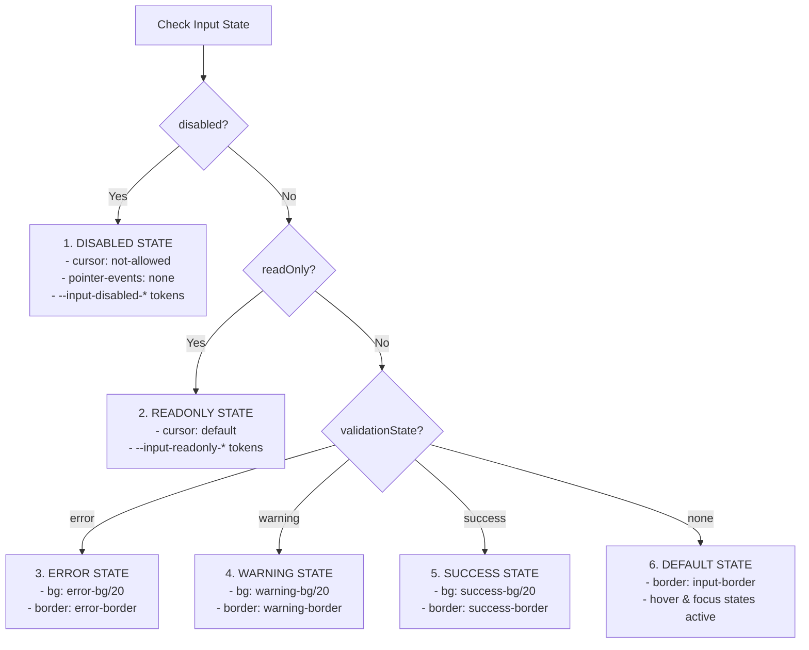

# ⌨️ Input Component

The `Input` component allows users to enter and edit text or numeric values. It is designed to be a pure interaction component, separating data entry styles from the label and descriptive messaging which are handled by `FormField`.

---

## 📖 Purpose
Inputs capture user responses in forms, searches, and data filters. 

---

## 🚦 When to Use vs When Not to Use

### When to Use
* For standard alphanumeric and text inputs (e.g. usernames, search boxes, passwords).
* When you need input formatting features like pre-appended/post-appended slots (e.g. price symbols or search icons).

### When Not to Use
* For long, multi-line answers — use `Textarea` instead.
* For choices out of a list — use `Select` or `Combobox`.

---

## 🎨 Token Hierarchy & Namespace

The component resolves all styles using component tokens scoped to the `--input-*` namespace, mapping back to semantic and primitive tokens:

| Component Token | Maps To (Semantic) | Description |
|---|---|---|
| `--input-bg` | `--color-surface-overlay` | Core input background fill |
| `--input-border` | `--color-border` | Default border line |
| `--input-border-hover` | `--color-muted` | Hover outline border color |
| `--input-border-focus` | `--color-primary` | Active focused input border |
| `--input-text` | `--color-text` | Typography color for values |
| `--input-placeholder` | `--color-muted` | Placeholder label styling |
| `--input-caret` | `--color-primary` | Text cursor color |
| `--input-ring` | `--color-primary` | Outline focus glow ring |
| `--input-disabled-bg` | `--color-surface-disabled` | Inactive grey fill |
| `--input-readonly-bg` | `--color-surface-2` | Non-editable background |

---

## 📐 Specifications & Sizes

Every size specifies its own height, padding, text size, and inline spacing:

- **Compact (`sm`)**:
  - Height: `32px` (`h-8`)
  - Typography: `text-sm`
  - Horizontal padding: `12px` (`px-3`)
  - Left / Right Slot space: `32px` padding override (`pl-8` / `pr-8`)
- **Default (`md`)**:
  - Height: `40px` (`h-10`)
  - Typography: `text-sm`
  - Horizontal padding: `16px` (`px-4`)
  - Left / Right Slot space: `40px` padding override (`pl-10` / `pr-10`)
- **Large (`lg`)**:
  - Height: `48px` (`h-12`)
  - Typography: `text-base`
  - Horizontal padding: `16px` (`px-4`)
  - Left / Right Slot space: `48px` padding override (`pl-12` / `pr-12`)

---

## 🚦 State Machine Precedence

Validation, interactivity, and disabled states are resolved in the following priority order:



---

## 📊 Component State Matrix

| State | Visual Indicator(s) | ARIA & Accessibility | Trigger Condition |
|---|---|---|---|
| **Default** | Border is `--input-border`, background `--input-bg`, text `--input-text` | None | Normal editable state |
| **Hover** | Border color transitions to `--input-border-hover` | None | Mouse/Touch hovering on input track |
| **Focused** | Border color shifts to `--input-border-focus`, focus ring transitions on | `:focus-visible` only (standard input focus) | Element focused (`Tab` or clicked) |
| **Disabled** | Opacity 50%, background `--input-disabled-bg`, cursor `cursor-not-allowed` | `disabled` and `aria-disabled="true"` | `disabled={true}` |
| **Read-only** | Background is `--input-readonly-bg`, cursor `cursor-default` | `readOnly` and `aria-readonly="true"` | `readOnly={true}` |
| **Error** | Background tint, border `--input-error-border`, error message below | `aria-invalid="true"` | `validationState="error"` or `error` prop populated |
| **Warning** | Background tint, border `--input-warning-border`, warning message | None | `validationState="warning"` |
| **Success** | Background tint, border `--input-success-border`, valid check icon | None | `validationState="success"` or `isValid={true}` |
| **Empty** | Placeholder text rendered with `--input-placeholder` typography | None | Input value is `""` or undefined |

---

## ♿ Accessibility (WCAG 2.2 AA)

- **Focus Indication**: Keyboard navigation triggers focus outlines only via `:focus-visible`, utilizing `focus-visible:ring-2` to avoid visual distraction for mouse users.
- **ARIA Attribute Integration**:
  - Sets `aria-invalid="true"` when `validationState="error"`.
  - Sets `aria-required`, `aria-readonly`, and `aria-disabled` automatically.
- **Password Visibility Target**:
  - Uses `onMouseDown={e => e.preventDefault()}` on the toggle button to avoid stealing focus from the input field.
  - Generates dynamic screen-reader descriptors (`Show password` / `Hide password`).
  - Extends touch hit targets for easy mobile access (`after:inset-[-4px]`).

### Keyboard Interactions

| Key | Action |
|---|---|
| `Tab` | Moves focus into the input field. |
| `Escape` | Dismisses focus (standard browser behavior). |

---

## 💻 Usage Examples

### Simple Input wrapped in FormField
```tsx
import Input from "@/shared/ui/Input";

<Input 
  label="Email Address" 
  error="Please enter a valid email address"
  placeholder="you@domain.com"
  required 
/>
```

### Slots (Left/Right Adornment)
```tsx
<Input 
  leftSlot={<span>$</span>}
  rightSlot={<span>USD</span>}
  placeholder="0.00"
  type="number"
/>
```

### Password Input with Accessible Toggle
```tsx
<Input 
  type="password" 
  showVisibilityToggle 
  placeholder="Enter your password" 
/>
```

---

## ✅ Do & ❌ Don't

* **Do** let `FormField` manage the labels and validation text layout; do not hardcode titles inside the input wrapper.
* **Do** use standard slots (`leftSlot` / `rightSlot`) to append/prepend indicators.
* **Don't** allow disabled or readonly inputs to apply hover states.
* **Don't** hide visibility buttons or slots from keyboard tab accessibility if they are interactive.
